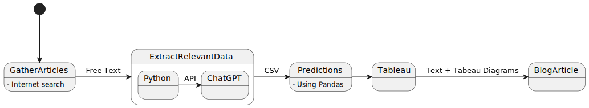

# Hackathon 

## 21.10.2023

- New project
- New organisation on Github setup
- [Datasets](https://drive.google.com/drive/folders/1N-opCC1nnZl0L3ATsz_ovrSphF6GHBYF)

## The Plan


```
@startuml
[*] --> GatherArticles
GatherArticles -> ExtractRelevantData : Free Text
GatherArticles : - Internet search 
ExtractRelevantData -> Predictions : CSV

state ExtractRelevantData {
  Python -> ChatGPT : API
}


Predictions : - Using Pandas
Predictions -> Tableau
Tableau -> BlogArticle : Text + Tabeau Diagrams
@enduml
```

## Gas & Electric consuption

- [Zprava o budoucí očekávané spotřebě](./Zpráva%20o%20budouci%20ocekavane%20spotrebe%20elektriny%20a%20plynu.docx)

### Electric Prediction summary 

 The document is a detailed analysis of the expected development of electricity demand in the Czech Republic until 2050. It is based on current strategies, visions, and plans of the Czech Government, as well as assumptions about future developments, particularly in regard to decarbonization.

The document is divided into two main development phases - RESTART and TRAFO. The RESTART phase lasts until 2030 and is characterized by the country's recovery and modernization after the COVID-19 pandemic, utilizing funds from the EU's 2021-2027 budget for green and modernization transformations. The TRAFO phase, from 2031 to 2050, represents the continuation of the transformation of the Czech economy and energy sector into a mature, innovative, green, and digitalized form.

Key factors in the forecast include an increased emphasis on electrification, particularly in the fields of electric mobility and thermal pumps, as well as the continued development of "prosumers" - consumers who also produce electricity. However, the report does not fully account for the conclusions and recommendations of the Hydrogen Strategy of the Czech Republic and the associated expected increase in future electricity consumption for hydrogen production.

After a significant drop in consumption in 2020 due to the pandemic, consumption is expected to increase slightly in 2021, and return to pre-pandemic levels by 2022. By 2030, the effects of electrification are expected to lead to faster growth in consumption compared to GDP, although this increase will be tempered by continued improvements in energy efficiency and the development of prosumers. From 2031 to 2050, the effects of medium electrification become significant, leading to a substantial increase in consumption despite a slowing in the rate of decrease in energy intensity.

The document concludes that the base prediction of domestic net consumption (TNS) is realistically achievable with a relatively high probability, as it aligns with the vision of the Czech Republic as a developed modern EU state by 2050 and is relatively conservative, consistent with a sustainable decarbonization strategy.

### Gas Prediction summary

The document describes the historical and expected future demand for natural gas in the Czech Republic. It notes that household and production sectors are the primary consumers, with uses spanning from industry, services, agriculture, transportation, electricity production, to heating. 

A significant factor affecting consumption is the replacement of coal used for heating in households with natural gas, along with similar trends in industry and district heating, and the use of gas for electricity production or mobility in the form of CNG or LNG vehicles.

According to the document, gas consumption in the 1990s grew due to gasification, peaking in 2001 at 124% of the 1995 consumption level. Since 2002, consumption has either fallen or remained constant under normal climatic conditions, due to savings (mainly in household consumption), transitions to other fuels, or increases in average outdoor temperatures.

The trend changed in 2015, when consumption started to rise again due to economic recovery (with a noticeable impact in the production sector) and the commissioning of the Počerady gas power plant (in 2013). In 2019, consumption rose to 118%.

The document also examines the factors influencing the demand for natural gas, including the role of natural gas in replacing coal in district heating and the production sector, and potential developments in the use of natural gas for electricity production and heating in households.

The document predicts that the overall demand for natural gas in the Czech Republic will rise until 2040, reaching a level of 130 TWh, primarily due to a shift away from coal use in industry and district heating, and an increase in gas consumption for mono-production of electricity. From 2040 onwards, a slight decrease or stagnation is expected in all segments, mainly due to energy savings in the industry and household segments.

- [Hodnoceni zdrojove přiměřenosti](./Hodnoceni%20zdrojove%20primerenosti.docx)

###	Očekávaný vývoj poptávky elektřiny summary

This document is in Czech and provides a medium-term outlook for the production capacities of the electricity system in the Czech Republic. It discusses the current state of production capacities and their likely future development, focusing on the outlook for the operation of various types of production sources.

The document presents a detailed analysis of the production structure and energy mix of different types of energy sources. It states that the highest share in the Czech Republic's energy production continues to be from sources with fuel boilers and steam turbines, which primarily burn brown and black coal. However, production in this segment showed a sharp increase in 2021 due to increased economic activity and higher gas prices on commodity exchanges. 

The document also discusses the outlook for nuclear power plants, which saw an increase in production in 2020. The Czech electricity system (ES CR) carries out annual surveys to estimate the medium-term outlook for the operation of sources. The document provides projections for the development of installed power of thermal, water, and pumped storage power plants up to 2040.

The document then discusses the use of fossil fuels, coal power plants, gas power plants, and district heating. It mentions that the production of electricity and heat from coal sources is characterized by high CO2 emissions per unit of produced electricity. Therefore, the gradual phase-out of coal sources is one of the necessary requirements for achieving decarbonization goals at the national and European level.

The document also discusses the production of electricity from renewable energy sources (RES) and decentralized energy. It provides projections for the development of installed power of photovoltaic and wind power plants up to 2040. It suggests that new sources will not represent more than 11.8% of the current installed power, and the development of the source base will be largely determined by the growth of decentralized sources.

In conclusion, the document suggests that the operation of existing power plants will be crucial for the medium-term outlook of the Czech Republic's source base, as well as compliance with the construction schedule for new sources. The future of electricity and heat production from coal remains very uncertain. The transformation of coal sources to burn biomass, natural gas, or waste is considered, but this transformation has its limits and difficulties in terms of the availability of the necessary amount of fuel.